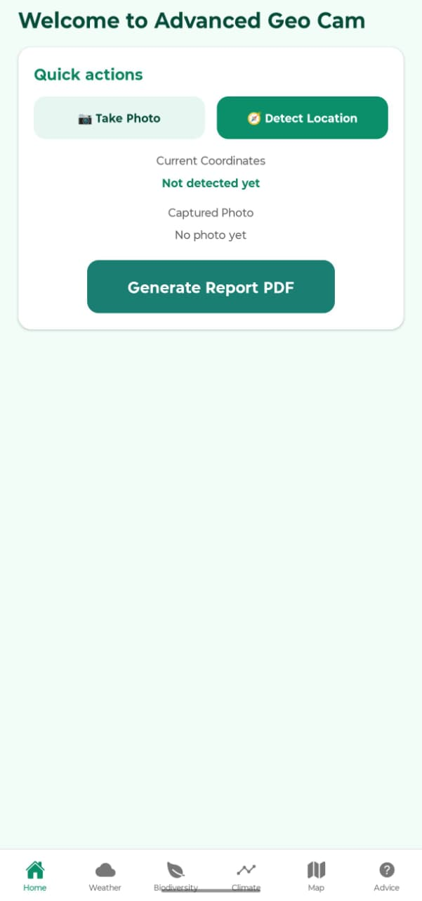
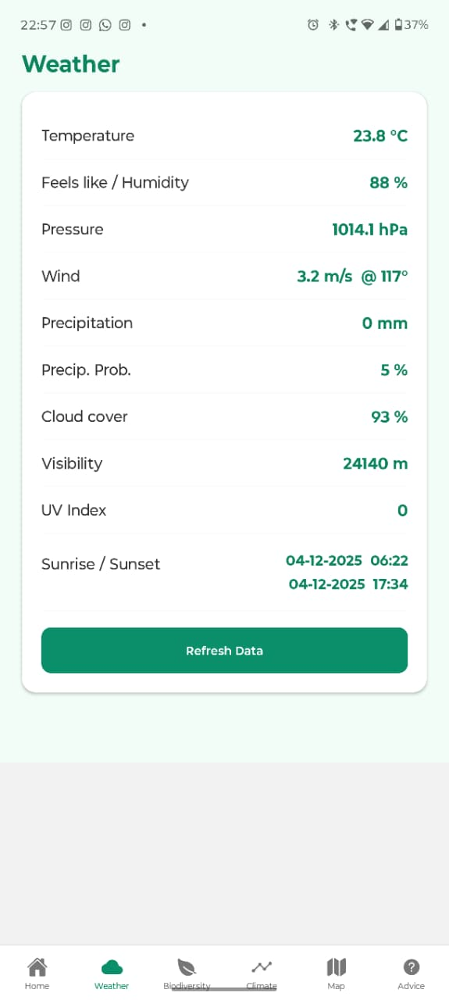
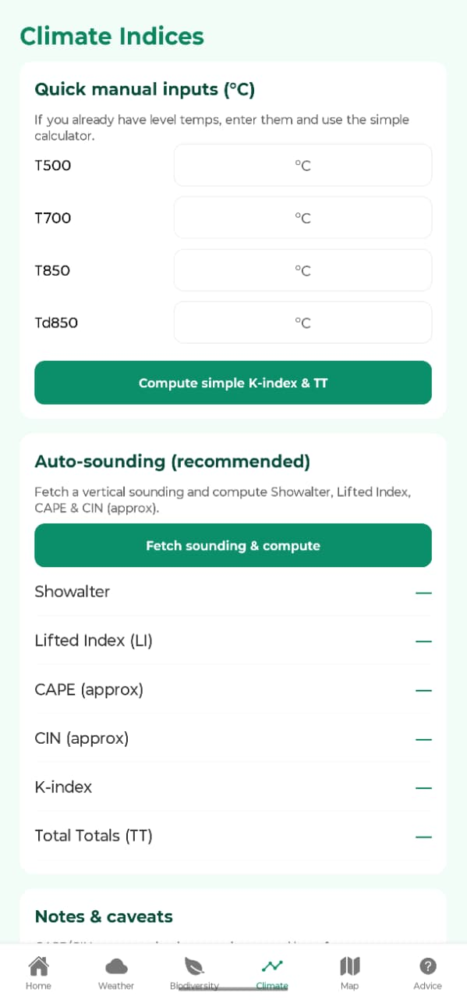
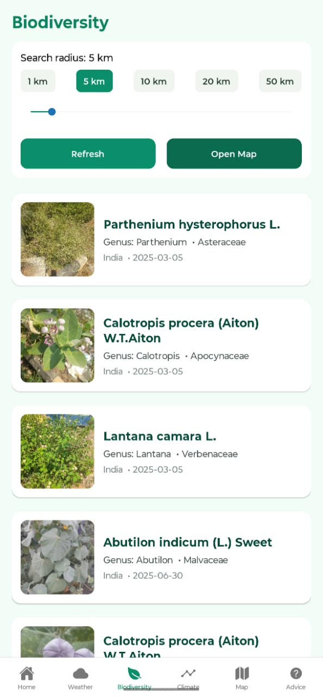
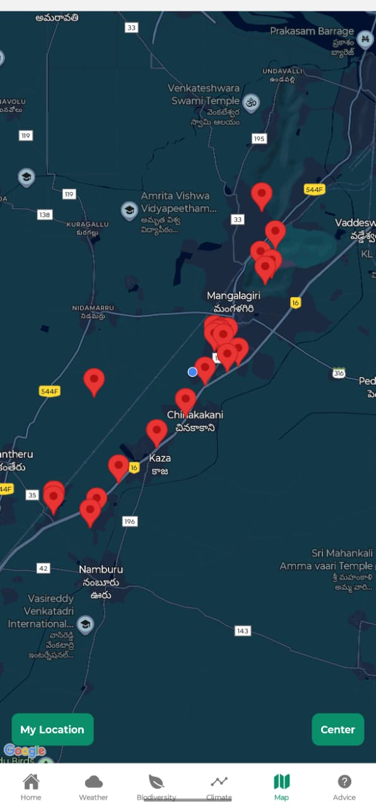
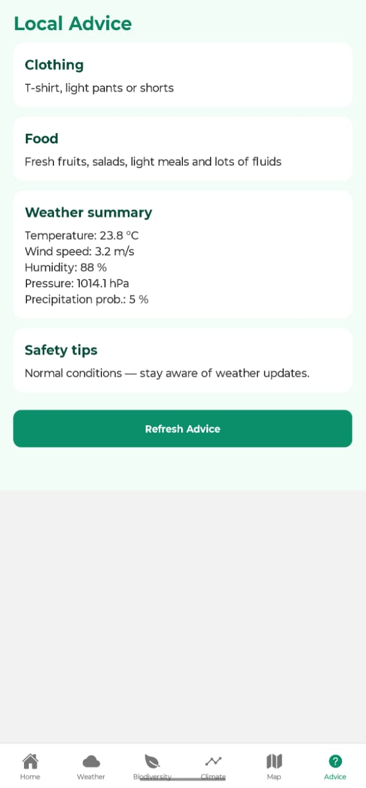
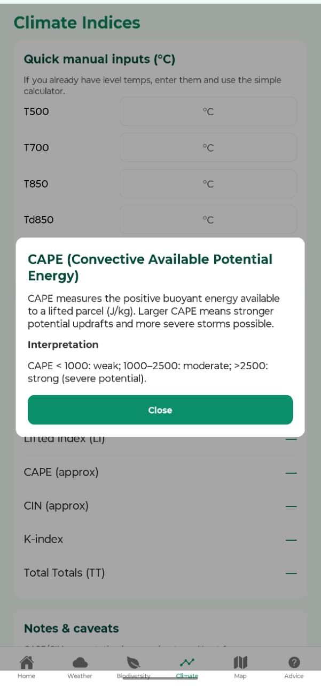
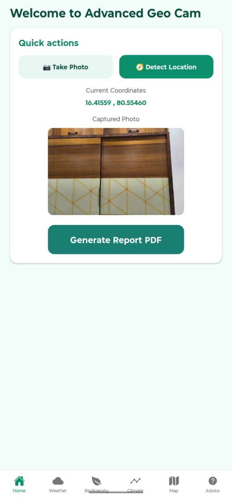

<div align="center">

# 🌍 Advanced Geo Cam

### Environmental Data Integration & Field Intelligence System

*A cross-platform mobile application for geospatial data acquisition, environmental monitoring, biodiversity exploration, atmospheric analysis, and automated report generation.*


</div>

---

# 📖 Overview

Advanced Geo Cam is a mobile-based environmental intelligence system developed as part of the **University Research Oriented Project (UROP)**.

The application integrates **mobile sensing**, **geospatial technologies**, **meteorological analysis**, and **biodiversity exploration** into a single platform.

Using only a smartphone, users can:

- Capture geotagged photographs
- Detect precise GPS coordinates
- Retrieve live weather conditions
- Compute atmospheric stability indices
- Explore nearby biodiversity
- View interactive maps
- Receive location-based recommendations
- Generate professional PDF field reports

The project demonstrates the integration of multiple APIs, environmental science concepts, and modern mobile application development.

---

# 📱 Application Preview

<table>
<tr>
<td align="center"><b>🏠 Home</b></td>
<td align="center"><b>🌦 Weather</b></td>
</tr>

<tr>
<td></td>
<td></td>
</tr>

<tr>
<td align="center"><b>🌩 Climate Indices</b></td>
<td align="center"><b>🌿 Biodiversity</b></td>
</tr>

<tr>
<td></td>
<td></td>
</tr>

<tr>
<td align="center"><b>🗺 Interactive Map</b></td>
<td align="center"><b>💡 Local Advice</b></td>
</tr>

<tr>
<td></td>
<td></td>
</tr>

<tr>
<td align="center"><b>📷 Camera</b></td>
<td align="center"><b>📖 Climate Information</b></td>
</tr>

<tr>
<td></td>
<td></td>
</tr>

<tr>
<td align="center" colspan="2"><b>📍 Home After Capture</b></td>
</tr>

<tr>
<td colspan="2" align="center">

</td>
</tr>

</table>

---

# 🚀 Key Features

### 📷 Smart Image Capture

- Capture photographs directly using the device camera
- Select existing images from gallery
- Automatic GPS coordinate acquisition
- Image preview before report generation

---

### 📍 Geolocation

- High accuracy GPS detection
- Latitude & Longitude acquisition
- Automatic coordinate retrieval after image capture
- Live location support

---

### 🌦 Weather Monitoring

Provides real-time weather information including

- Temperature
- Humidity
- Pressure
- Wind Speed
- Wind Direction
- Visibility
- UV Index
- Cloud Cover
- Precipitation
- Rain Probability
- Sunrise
- Sunset

---

### 🌩 Climate Indices

Supports both

- Manual calculation
- Automatic sounding-based calculation

Implemented atmospheric indices

- CAPE
- CIN
- Lifted Index (LI)
- Showalter Index
- K Index
- Total Totals (TT)

Each index contains an interactive explanation popup describing

- Scientific meaning
- Interpretation
- Practical significance

---

### 🌿 Biodiversity Explorer

Uses GBIF API to retrieve nearby biodiversity.

Displays

- Scientific Name
- Genus
- Family
- Observation Date
- Species Image
- Search Radius

Supports

- Radius presets
- Dynamic search
- Interactive occurrence map

---

### 🗺 Interactive Map

- Displays biodiversity observations
- Current device location
- Center-to-user button
- Live map interaction

---

### 👕 Local Advice

Provides recommendations based on current weather.

Includes

- Clothing suggestions
- Food suggestions
- Weather summary
- Safety recommendations

---

### 📄 PDF Report Generation

Automatically generates a professional environmental report containing

- Captured photograph
- GPS Coordinates
- Weather Information
- Climate Indices
- Biodiversity Summary
- Date & Time

The generated report can be

- Shared
- Downloaded
- Archived

---

# 🏗 System Architecture

```
                    USER

                      │

                      ▼

          Camera + GPS Acquisition

          │                    │

          ▼                    ▼

   Image Capture          Location Detection

          │                    │

          └──────────┬─────────┘

                     ▼

            Weather API Request

                     │

                     ▼

           Atmospheric Sounding

                     │

                     ▼

      Climate Indices Computation

                     │

          ┌──────────┴─────────┐

          ▼                    ▼

   Biodiversity API       Weather Data

          │                    │

          └──────────┬─────────┘

                     ▼

               Local Cache

                     │

                     ▼

           PDF Report Generator

                     │

                     ▼

            Share / Save Report
```

---

# 📱 Application Screens

## 🏠 Home Screen

Features

- Camera
- GPS Detection
- Captured Image Preview
- PDF Generation

---

## 🌦 Weather Screen

Displays

- Live Weather
- Atmospheric Conditions
- Sunrise & Sunset
- Refresh Capability

---

## 🌩 Climate Indices

Supports

- Manual Inputs
- Automatic Sounding Retrieval
- Stability Index Calculation
- Interactive Educational Popups

---

## 🌿 Biodiversity

Displays nearby

- Plants
- Species
- Observation Records
- Images

Supports multiple search radii.

---

## 🗺 Map

Interactive map showing

- Biodiversity observations
- Current location
- Marker clustering
- Center to current location

---

## 💡 Local Advice

Provides

- Clothing Suggestions
- Food Suggestions
- Weather Safety Tips

---

# 🔬 Scientific Concepts Used

## Atmospheric Sounding

Vertical atmospheric profile obtained from weather models.

Contains

- Pressure
- Temperature
- Humidity
- Wind

Used for atmospheric stability calculations.

---

## CAPE

Convective Available Potential Energy

Measures the amount of positive buoyant energy available for thunderstorms.

Higher CAPE indicates greater thunderstorm potential.

---

## CIN

Convective Inhibition

Represents energy preventing air parcels from rising.

Large CIN suppresses storm formation.

---

## Lifted Index

Compares parcel temperature with environmental temperature.

Negative values indicate atmospheric instability.

---

## Showalter Index

Evaluates thunderstorm potential using lifted parcel analysis.

---

## K Index

Measures moisture and temperature characteristics.

Used for thunderstorm forecasting.

---

## Total Totals Index

Predicts severe weather using temperature gradients.

---

# 🛠 Technology Stack

## Mobile Development

- Expo React Native
- TypeScript
- React Navigation

## APIs

- Open-Meteo API
- GBIF API

## Expo Libraries

- expo-location
- expo-image-picker
- expo-file-system
- expo-print
- expo-sharing

## Maps

- react-native-maps

---

# 📂 Project Structure

```
Advanced-Geo-Cam

├── assets
├── src
│   ├── api
│   ├── components
│   ├── navigation
│   ├── screens
│   ├── styles
│   └── utils
├── App.tsx
├── app.json
├── package.json
└── README.md
```

---

# ⚙ Installation

Clone the repository

```bash
git clone https://github.com/KMK32/geo-cam.git
```

Move into project

```bash
cd geo-cam
```

Install dependencies

```bash
npm install
```

Start Expo

```bash
npx expo start
```

Scan the QR code using Expo Go.

---

# 👥 Team

## Project Lead

### **Karanam Miteesh Kaushik**

- System Architecture
- Mobile Application Development
- API Integration
- Climate Indices Implementation
- Biodiversity Module
- Weather Module
- Interactive Maps
- PDF Report Generation
- Testing & Integration
- GitHub Repository Management

---

## Team Members

### Abhiram

- UI/UX Review
- Functional Testing
- Feature Validation
- User Acceptance Testing

### Tanay

- Weather & Biodiversity Research
- Documentation Support
- Test Case Validation
- Literature Survey

### Shafe

- Requirement Analysis
- Functional Testing
- Presentation Preparation
- Documentation

---

# 🎯 Applications

- Environmental Monitoring
- Biodiversity Survey
- Agriculture
- Disaster Management
- Meteorological Research
- Field Data Collection
- Ecological Studies
- Educational Research

---

# 🔮 Future Scope

- AI-based Plant Identification
- Offline Mode
- Cloud Synchronization
- User Authentication
- GIS Layer Integration
- Satellite Image Overlay
- Machine Learning Weather Prediction
- Advanced Atmospheric Modeling

---

# 📜 License

This project is licensed under the **MIT License**.

---

# 🙏 Acknowledgements

- Open-Meteo
- GBIF
- Expo
- React Native
- University Research Oriented Project (UROP)

---

<div align="center">

### ⭐ If you found this project interesting, consider giving it a star!

**Advanced Geo Cam**
*Making Environmental Intelligence Portable.*

</div>
